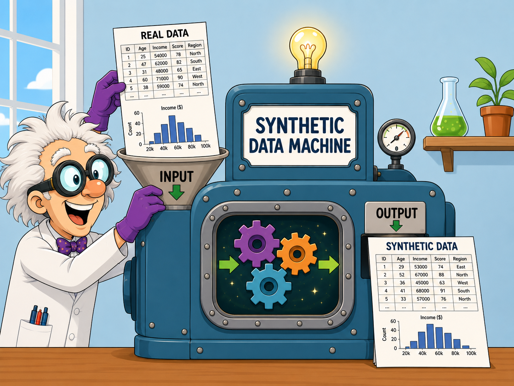

## About me

::: {.columns}
:::: {.column width="55%"}
Thom Benjamin Volker

- Utrecht University \& Statistics Netherlands
- PhD. Candidate in Methodology and Statistics
::::

:::: {.column width="5%"}
 
::::

:::: {.column width="40%"}
{style="border-radius:30px; overflow:hidden; border:2px solid #12244d"}
::::

:::

Statistician, data scientist

# Nowadays, more data is collected than ever before^[According to [Statista](https://www.statista.com/statistics/871513/worldwide-data-created/), approximately 163 zettabytes (163.000.000.000.000 GB) of data was created in the year 2025 alone.]

    

## The entire world is digital

- News articles

- Libraries

- Soil data

- Economic indices

- Social media

- Your online web-browsing behavior

- CBS data

- Research data

## Data is a gold mine

<a id='gad7pGlPSBBNlcooEl3qyA' class='gie-single' href='https://www.gettyimages.com/detail/992833432' target='_blank' style='color:#a7a7a7;text-decoration:none;font-weight:normal !important;border:none;display:inline-block;'>Embed from Getty Images</a>

## Researchers need rich data!

- Tracking pandemics in real time

- Statistics Netherlands (CBS) population registry

- FIRMBACKBONE: Dutch longitudinal data of registered companies

## Companies also benefit from rich data

- Stock market predictions

- Predicting trends

- Almost all webshops evaluate their marketing success

# All that glisters is not gold

::: {.emph}
(Open) data puts us at risk!
:::

   

:::{.fragment}

_5 minute assignment: Think about risks of open data for (1) individuals, and (2) companies._

:::

## (Open) data risks

__For individuals__: identity theft, fraud, stalking, discrimination, blackmail, deepfakes

__For companies__: leakage of trade secrets, customer targeting by competitors, copyright or IP issues, reputational damage

__For the general public__: misinformation, surveillance, unequal power, loss of trust, drowning in low-quality data, and environmental costs of storing and processing massive datasets

## Some known data breaches

- Netflix prize data

- Strava runs of military personnel

- And of course all kinds of hacks

::: {.emph}

Connecting different data sources may amplify risks!

:::

# Should we stop collecting and sharing data?

::: {.fragment}

:::: {.emph}

__We need better protection strategies!__

::::

:::

## Data protection strategies

::: {.fragment .semi-fade-out fragment-index=1}

- No data sharing (wasteful)

- (Physical) research data centers

- Remote access servers

- Disseminating aggregate statistics

- Data perturbation

:::

- Synthetic data

::: {.fragment .semi-fade-out fragment-index=1}

- Open data disseminatio (harmful)

:::

## Synthetic data

::: {.emph}

___Synthetic data__ are data that are generated from a model or algorithm, with the aim of mimicking (some aspects of) the observed data._^[As opposed to real world, collected data.]

:::

# {background-iframe='https://whichfaceisreal.com/index.php'}

## The synthetic data machine

# Using synthetic data

We want to do the same things with synthetic data that we could do with the real data, without the privacy risks related to the real data.

# Questions?

Feel free to reach out: [t.b.volker@uu.nl](mailto:t.b.volker@uu.nl)

[thomvolker.github.io/masking-lecture](https://thomvolker.github.io/masking-lecture)

