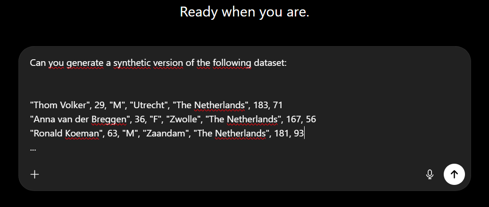

## About me

::: {.columns}
:::: {.column width="55%"}
Thom Benjamin Volker

- Utrecht University \& Statistics Netherlands
- PhD. Candidate in Methodology and Statistics
::::

:::: {.column width="5%"}
<br>
::::

:::: {.column width="40%"}
{style="border-radius:30px; overflow:hidden; border:2px solid #12244d"}
::::

:::

Statistician, data scientist

# Nowadays, more data is collected than ever before^[According to [Statista](https://www.statista.com/statistics/871513/worldwide-data-created/), approximately 163 zettabytes (163.000.000.000.000 GB) of data was created in the year 2025 alone.]

<br><br><br><br>

## The entire world is digital

- News articles

- Libraries

- Soil data

- Economic indices

- Social media

- Your online web-browsing behavior

- CBS data

- Research data

## Data is a gold mine


<a id='gad7pGlPSBBNlcooEl3qyA' class='gie-single' href='https://www.gettyimages.com/detail/992833432' target='_blank' style='color:#a7a7a7;text-decoration:none;font-weight:normal !important;border:none;display:inline-block;'>Embed from Getty Images</a><script>window.gie=window.gie||function(c){(gie.q=gie.q||[]).push(c)};gie(function(){gie.widgets.load({id:'gad7pGlPSBBNlcooEl3qyA',sig:'3RRFu4XHBKNSzOkpWoTaCtxu0mXlE60r45I9A21_X88=',w:'509px',h:'339px',items:'992833432',caption: true ,tld:'com',is360: false })});</script><script src='//embed-cdn.gettyimages.com/widgets.js' charset='utf-8' async></script>

## Researchers need rich data!

- Tracking pandemics in real time

- Statistics Netherlands (CBS) population registry

- FIRMBACKBONE: Dutch longitudinal data of registered companies

## Companies also benefit from rich data

- Stock market predictions

- Predicting trends

- Almost all webshops evaluate their marketing success

# All that glisters is not gold

::: {.emph}
(Open) data puts us at risk!
:::

<br> <br>

:::{.fragment}

_5 minute assignment: Think about risks of open data for (1) individuals, and (2) companies._

:::

## (Open) data risks

__For individuals__: identity theft, fraud, stalking, discrimination, blackmail, deepfakes

__For companies__: leakage of trade secrets, customer targeting by competitors, copyright or IP issues, reputational damage

__For the general public__: misinformation, surveillance, unequal power, loss of trust, drowning in low-quality data, and environmental costs of storing and processing massive datasets


## Some known data breaches

- Netflix prize data

- Strava runs of military personnel

- And of course all kinds of hacks

::: {.emph}

Connecting different data sources may amplify risks!

:::


# Should we stop collecting and sharing data?

::: {.fragment}

:::: {.emph}

__We need better protection strategies!__

::::

:::

## Data protection strategies

::: {.fragment .semi-fade-out fragment-index=1}

- No data sharing (wasteful)

- (Physical) research data centers

- Remote access servers

- Disseminating aggregate statistics

- Data perturbation

:::

- Synthetic data

::: {.fragment .semi-fade-out fragment-index=1}

- Open data dissemination (harmful)

:::

# Data anonymization

What is identifying information?

## Synthetic data

::: {.emph}

___Synthetic data__ are data that are generated from a model or algorithm, with the aim of mimicking (some aspects of) the observed data._^[_Fake data, generated data, digital twins._ As opposed to real world, collected data.]

:::

# {background-iframe='https://whichfaceisreal.com/index.php'}


## The synthetic data machine


# Don't you ever!




# Learning the structure of a data set

What features are important?

## Distinguishing signal from noise

::: {.columns}

:::: {.column}

```{r}
#| fig-height: 10


library(ggplot2)
library(patchwork)


set.seed(123)
x <- runif(500, 0, 10)
set.seed(123)
p1 <- ggplot() +
    geom_point(
        mapping = aes(
            x = x,
            y = 0.5 * x + sin(2*x) + rnorm(500, 0, 0.5)
        ),
        col = "navy",
        size = 3
    ) +
    geom_function(fun = \(x) 0.5*x + sin(2*x), linewidth = 1.5, col = "orange")
set.seed(123)
p2 <- ggplot() +
    geom_point(
        mapping = aes(
            x = x,
            y = 0.5 * x + sin(2*x) + rnorm(500, 0, 2)
        ),
        col = "navy",
        size = 3
    ) +
    geom_function(fun = \(x) 0.5*x + sin(2*x), linewidth = 1.5, col = "orange")


p1 +
    theme_minimal() +
    ylab("y") +
    ylim(-6, 11) + 
    theme(
        plot.background = element_rect(fill = "#fffbf2")
    )
```

::::

:::: {.column}

::::: {.fragment .fade-left}

```{r}
#| fig-height: 10

p2 +
    theme_minimal() +
    ylab("y") +
    ylim(-6, 11) +
        theme(
        plot.background = element_rect(fill = "#fffbf2")
    )
```

:::::

::::

:::

## Example: The U.S. Current Population Survey

- 5000 individuals

```{r}
load("data/cps5000.RData")
library(tibble)

obs <- tibble(
    age = cps$age, 
    income = cps$income,
    social_security = cps$ss
) |> as.data.frame()
syn1 <- mvtnorm::rmvnorm(
    nrow(cps),
    colMeans(obs),
    sigma = var(obs)
) |> as.data.frame()

syn2 <- synthpop::syn(
    obs, method = "cubertnorm", semicont = list(income = 0, social_security = 0), print = FALSE
)$syn |> as.data.frame()
```

- Variables: `tax`, `income`, `age`, `educ`, `marital status`, `race`, `sex`, `social security`

## Univariate distributions


::: {.columns}

::: {.column}

```{r}
#| results: false
#| fig-height: 10
u1 <- synthpop::compare.data.frame(syn1, obs, vars = c("age", "social_security"), ncol = 1, print.flag = FALSE)
u1$plots +
    theme_minimal() +
    theme(plot.background = element_rect(fill = "#fffbf2"))
```

:::

::: {.column}

::::{.fragment .fade-left}

```{r}
#| results: false
#| fig-height: 10

u2 <- synthpop::compare.data.frame(syn2, obs, vars = c("age", "social_security"), ncol = 1, print.flag = FALSE)
u2$plots +
    theme_minimal() +
    theme(plot.background = element_rect(fill = "#fffbf2"))
```

::::

:::

:::


## Multivariate distributions


::: {.columns}

::: {.column}

```{r}
#| fig-height: 10

ggplot(
    dplyr::bind_rows(obs = obs, syn = syn1, .id = "Type"),
    mapping = aes(x = age, y = social_security, col = Type)
) +
    geom_point(alpha = 0.2, size = 2) +
    scale_color_brewer(palette = "Set1") +
    theme_minimal() +
    guides(colour = guide_legend(override.aes = list(alpha = 1))) +
    theme(plot.background = element_rect(fill = "#fffbf2"))
```

:::

::: {.column}

:::: {.fragment .fade-left}

```{r}
#| fig-height: 10

ggplot(
    dplyr::bind_rows(obs = obs, syn = syn2, .id = "Type"),
    mapping = aes(x = age, y = social_security, col = Type)
) +
    geom_point(alpha = 0.2, size = 2) +
    scale_color_brewer(palette = "Set1") +
    theme_minimal() +
    guides(colour = guide_legend(override.aes = list(alpha = 1))) +
    theme(plot.background = element_rect(fill = "#fffbf2"))
```

::::

:::

:::

# Privacy risks

## Identity disclosure


<br><br>

:::{.emph}
The ability to identify an individual from the synthetic data
:::

## Attribute disclosure

<br><br>

:::{.emph}
The ability to learn an attribute (e.g., some characteristic) of an individual from the synthetic data
:::

# The privacy-utility trade-off

## Utility versus privacy {.smaller}

__Utility__

- Can I do the same things with the synthetic data as with the real data?
- Are the synthetic data characteristics the same as the observed data characteristics?

__Privacy__

- Can I reproduce the original data from the synthetic data?
- Can I determine whether a person was part of the original data?
- Can I estimate person-specific characteristics with great precision?

##

```{dot}
//| echo: false
//| fig-width: 10.5
//| fig-height: 6
//| fig-align: center

graph G {
  graph [
    layout=neato,
    outputorder=edgesfirst,
    bgcolor="transparent",
    margin=0,
    pad=0.1,
    splines=line,
    overlap=false,
    sep=0,
    size="16,9!",
    ratio=fill
  ];

  node [
    shape=plaintext,
    fontname="Helvetica",
    fontcolor="#333842"
  ];

  edge [
    color="#155B78",
    penwidth=5,
    arrowsize=1.2
  ];

  title [
    label=< <B>How much does the synthetic<BR/>data look like the real data?</B> >,
    pos="8,7.7!",
    fontsize=28
  ];

  leftTop [
    label=< <I>Perfect imitation</I> >,
    pos="2.5,4.75!",
    fontsize=26
  ];

  rightTop [
    label=< <I>I don&apos;t know what<BR/>I&apos;m looking at</I> >,
    pos="12.45,4.95!",
    fontsize=26
  ];

  utility [
    label=< <B>Utility</B> >,
    pos="1.6,3.65!",
    fontsize=27
  ];

  privacy [
    label=< <B>Privacy</B> >,
    pos="13.95,3.65!",
    fontsize=27
  ];

  caption [
    label=< <B>In principle, you always lose information when creating synthetic<BR/>data. The question is &lsquo;how much information do you need to<BR/>sacrifice in order to protect privacy?&rsquo;</B> >,
    pos="8,1.1!",
    fontsize=20
  ];

  a [
    label="",
    shape=point,
    width=0.01,
    height=0.01,
    pos="1.2,4.05!",
    style=invis
  ];

  b [
    label="",
    shape=point,
    width=0.01,
    height=0.01,
    pos="14.8,4.05!",
    style=invis
  ];

  a -- b [
    dir=both,
    arrowtail=normal,
    arrowhead=normal
  ];
}
```

## Tools for generating synthetic data

Many software programs exist (mainly in programming languages like `R` and `python`)

- For tabular data: specify model for each variable

- For images: deep learning model for the entire image

- For text, videos: deep learning models for sequences

# Using synthetic data

We want to do the same things with synthetic data that we could do with the real data, without the privacy risks related to the real data.

## Synthetic data use-cases

Dummy data

Data for education

Data for testing and model-building

Replication packages

Novel research?


## Advantages of synthetic data

Privacy can be well protected

- No real records anymore

- Information that goes into the synthesis model can be bounded

A large amount of information can be preserved

- Model can be enriched with additional information

## Possible extensions

Encode prior or external information

- Different data sources

Borrow strength from different domains

## Disadvantages of synthetic data

Quality of synthetic data depends entirely on the synthesis model; and can be hard to evaluate

- Too simple models might omit important data characteristics

- Complex sythesis models obscure what information is reproduced in the synthetic data

Synthetic data can live a life of it's own

## Assignment

1. Discuss a case where you may be harmed by your own published (real or hypothetical) data

2. Discuss whether synthetic data can serve as a protection method, or whether something else is required

3. Evaluate potential downsides of the protection methods

__Approximately 500 words__

# Questions?

Feel free to reach out: [t.b.volker@uu.nl](mailto:t.b.volker@uu.nl)

[thomvolker.github.io/masking-lecture](https://thomvolker.github.io/masking-lecture)

